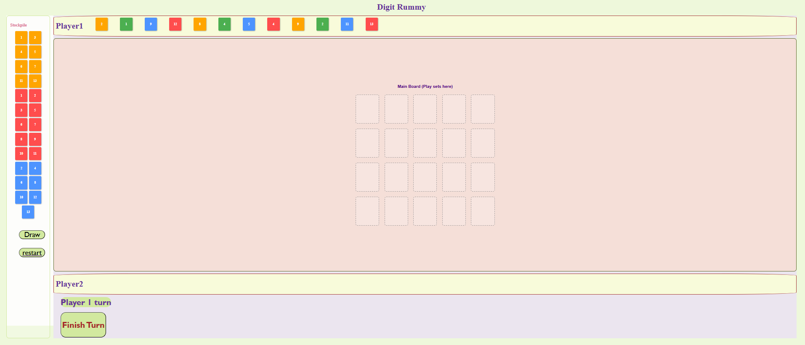

# Digit-Rummy

## Starting-Date : 05/02/2026

### Done By: Intisar Abdulla

[LinkedIn]([linkedin.com/in/intisar-abdulla67/](https://www.linkedin.com/in/intisar-abdulla67?lipi=urn%3Ali%3Apage%3Ad_flagship3_profile_view_base_contact_details%3BYvGJL%2Bu1RjmH4XayFTfMnw%3D%3D)) | [Github](https://github.com/intisarHJM) | [Website]()

***

#### ***Description***
is a digital adaptation of a strategic pattern-matching board game for
**2 players**, recreating the physical "Digit" tile game experience in the browser. Players compete to empty their hands by forming valid **melds** (sequences/sets) on a shared **Playground**, with a unique **60-second turn timer** and

**🔑 Main Requirement: Initial Meld to Enter Playground 3+ consecutive numbers, SAME COLOR (e.g., Red 11-12-13)**

**Full rules in [Game Protocol](#game-protocol) section below**
***

#### ***Technologies***
- **VS Code** + ESLint + Prettier + Live Server
   * HTML5, CSS3, Vanilla JS (ES6+)
   * DOM API
   * Dynamic rendering & drag/drop

- **Git/GitHub** - Version control

***
#### ***Getting Started***

1. **Enter player names** (2 players minimum) in textboxes
2. Click **"START GAME"**
3. **Player 1**: Click **"Choose 12 random tiles"** → **"DONE"**
4. **Player 2**: Click **"Choose 12 random tiles"** → **"DONE"** *(tiles hidden from opponent)*
5. **Game begins** - active player's name highlighted with turn controls

**Note**: Players take turns when their name appears with action buttons

***

#### ***Screenshots***

***

#### ***Future updates***
- [ ] More Players can be added.
- [ ] More tiles can be added like 1-13* 2copy * 4colors
- [ ] the game will include the initial meld rule.

***

## ***Game Protocol***

### 1. COMPONENTS

* 54 numbered tiles (1-13 of each number × 4 colors: Red, Blue, Green, Orange + smiley face tiles(☺))

* Playground mat (shared area Players can take action on switch the cards to make new patterns and add their remaining cards if they match)
* 2 player racks (hold 12 tiles each)
* 	60-second timer
* 	Score sheets

### 2. The Game Goal

    The First player to empty hand by playing valid patterns added to Playground wins.

### 3. SETUP

1. **Dealing Tiles:** tiles are randomly distributed to each player's rack.

2. **The Stock Pile:** All remaining tiles that were not dealt are placed in the Stock Pile at the side bar.

3. **Starting the Game:** The youngest player takes the first turn( Play then proceeds clockwise).

### 4. INITIAL MELD REQUIREMENT

 Must play (3+) tiles, SAME COLOR, total ≥ 30
 Example: Red (11 + 12 + 13) = 36

### 5. VALID PLAYGROUND MOVES

1. 	SEQUENCE: (3+) consecutive numbers, with SAME COLOR
* Blue [8 | 9 | 10 | 11] ✓    Blue [8|10|11] ✗
* 1(Red) – 2(Blue) – 3(Green) ✗

2. 	SET: Same number, with DIFFERENT COLOURS
* 7 (Red) + 7 (Blue) + 7 (Green) ✓

### 6. TURN STRUCTURE (60 SECONDS)

1.	Must have initial meld to enter Playground
2.	Rearrange any table tiles + add from hand
3.	Timer starts on first tile touch
4.	Say "PASS" to end turn

### 7. WINNING & SCORING

* 	First to empty hand wins.
* Losers score penalty = sum of remaining tiles
* Play multiple rounds to target score

***

#### ***Credits***
##### The Rummy Game Protocol: [Piatnik](https://piatnik.com/uploads/media/default/0001/07/9dc926e1347f08ce260f02863713ec50ed8ea996.pdf)

##### Mozilla Developer Network : [MDN](https://developer.mozilla.org/en-US/)
* [MDN drag and drop](https://developer.mozilla.org/en-US/docs/Web/API/HTML_Drag_and_Drop_API)
* [Cursor properties](https://developer.mozilla.org/en-US/docs/Web/CSS/Reference/Properties/cursor)
##### Drag and Drop implementation: [Drag and Drop Tutorial](https://youtu.be/lSCLnWoa6Tw?si=v9GJNjW07HMbyoWl)

